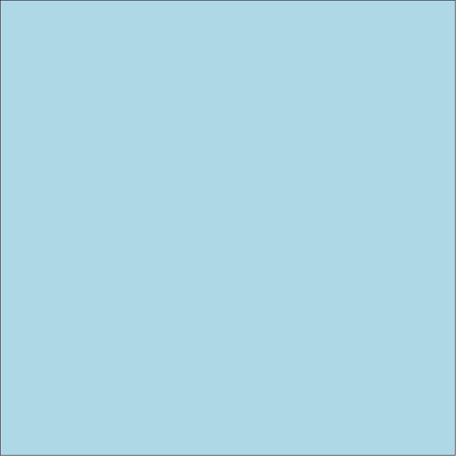
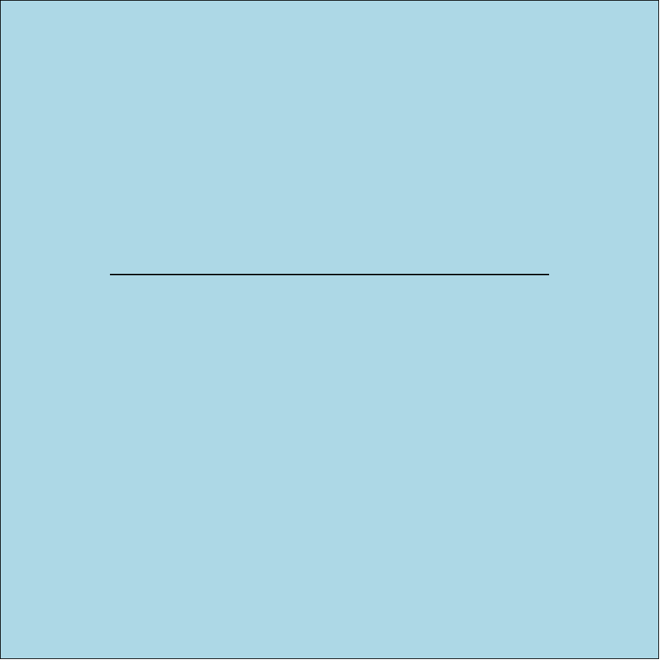

*Monifesto* is a library for drawing on a layered cavnas.

Here's how I'd like *Monifesto* to work.

# Draw a line

    import Monifesto
    monifesto = new Monifesto()
    monifesto.drawLine()

# Draw a layer

    import Monifesto
    monifesto = new Monifesto()
    background = monifesto.makeLayer()
    background.color(lightblue)

# Draw on a few layers

    import Monifesto
    monifesto = new Monifesto()
    background = monifesto.makeLayer(lightblue)
    foreground = monifesto.makeLayer()
    foreground.drawLine()

