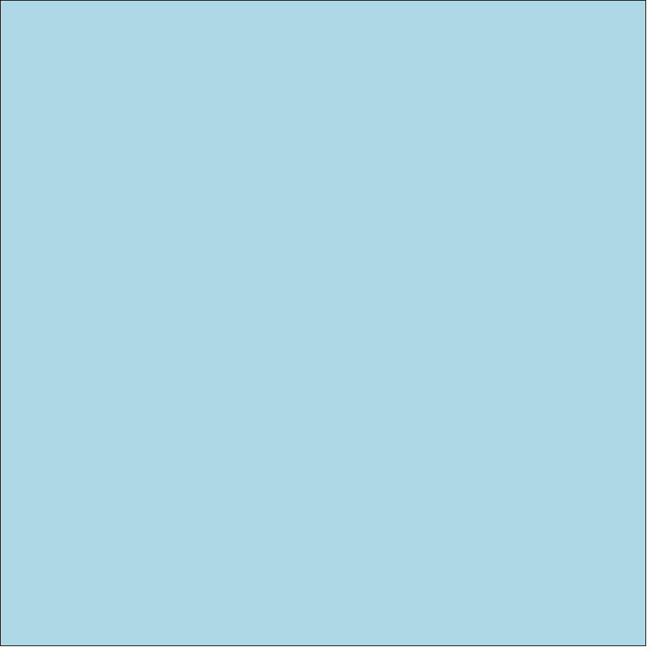
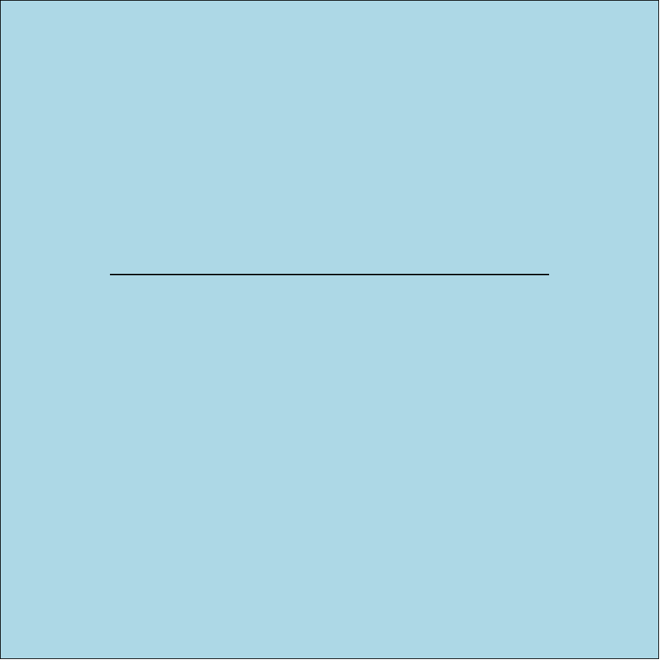

*Manifesto* is a library for drawing on a layered cavnas.

Here's how I'd like *Manifesto* to work.

# Draw a line

    import Manifesto
    manifesto = new Manifesto()
    manifesto.drawLine()

# Draw a layer

    import Manifesto
    manifesto = new Manifesto()
    background = manifesto.makeLayer()
    background.color(lightblue)

# Draw on a few layers

    import Manifesto
    manifesto = new Manifesto()
    background = manifesto.makeLayer(lightblue)
    foreground = manifesto.makeLayer()
    foreground.drawLine()

